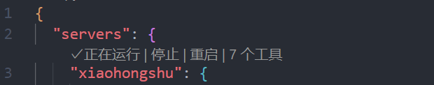
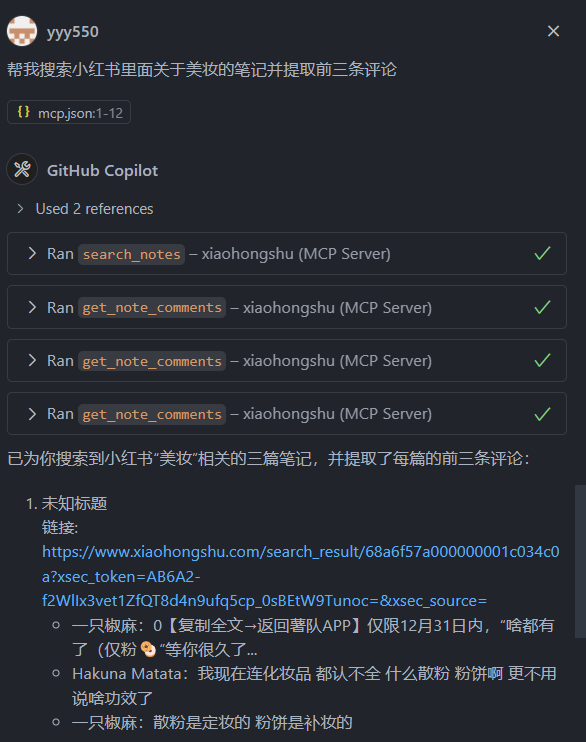

# 小红书 MCP 环境搭建配置介绍

<style scoped>
.slidev-page {
  background-color: rgba(232, 215, 195, 0.92) !important;
  background-image: none !important;
}
body {
  background-image: none !important;
}
</style>

详细介绍小红书 MCP 项目的环境搭建、配置与使用

<div class="pt-12">
  <span @click="$slidev.nav.next" class="px-2 py-1 rounded cursor-pointer" hover="bg-white bg-opacity-10">
    开始演示 <carbon:arrow-right class="inline"/>
  </span>
</div>

<div class="abs-br m-6 flex gap-2">
  <span class="text-sm opacity-50">按空格键或箭头键导航</span>
</div>

---
transition: fade-out
---

# 目 录

<style scoped>
.toc-container {
  display: grid;
  grid-template-columns: repeat(2, 1fr);
  gap: 12px;
  max-width: 900px;
  margin: 0 auto;
  padding: 0 20px;
}

.toc-item {
  display: flex;
  align-items: center;
  padding: 16px 20px;
  background: linear-gradient(135deg, rgba(59, 130, 246, 0.1) 0%, rgba(139, 92, 246, 0.1) 100%);
  border-radius: 12px;
  border: 1px solid rgba(59, 130, 246, 0.2);
  cursor: pointer;
  transition: all 0.3s ease;
  text-align: left;
}

.toc-item:hover {
  transform: translateY(-2px);
  background: linear-gradient(135deg, rgba(59, 130, 246, 0.2) 0%, rgba(139, 92, 246, 0.2) 100%);
  box-shadow: 0 8px 25px rgba(59, 130, 246, 0.15);
}

.toc-item:active {
  transform: translateY(0);
}

.toc-number {
  display: inline-flex;
  align-items: center;
  justify-content: center;
  width: 32px;
  height: 32px;
  background: linear-gradient(135deg, #3B82F6 0%, #8B5CF6 100%);
  color: white;
  border-radius: 8px;
  font-weight: bold;
  font-size: 14px;
  margin-right: 14px;
  flex-shrink: 0;
}

.toc-text {
  font-size: 15px;
  font-weight: 500;
  color: #1F2937;
  line-height: 1.4;
}

.toc-item:hover .toc-text {
  color: #3B82F6;
}

@media (max-width: 640px) {
  .toc-container {
    grid-template-columns: 1fr;
  }
}
</style>

<div class="toc-container">
  <div class="toc-item" @click="$slidev.nav.go(2)">
    <span class="toc-number">1</span>
    <span class="toc-text">Python 虚拟环境与依赖安装</span>
  </div>
  <div class="toc-item" @click="$slidev.nav.go(5)">
    <span class="toc-number">2</span>
    <span class="toc-text">.vscode/mcp.json 配置详解</span>
  </div>
  <div class="toc-item" @click="$slidev.nav.go(6)">
    <span class="toc-number">3</span>
    <span class="toc-text">为何 command 必须指向 venv 内 python.exe</span>
  </div>
  <div class="toc-item" @click="$slidev.nav.go(7)">
    <span class="toc-number">4</span>
    <span class="toc-text">VS Code 中确认 MCP Server 状态</span>
  </div>
  <div class="toc-item" @click="$slidev.nav.go(8)">
    <span class="toc-number">5</span>
    <span class="toc-text">Agent 模式下工具调用演示</span>
  </div>
  <div class="toc-item" @click="$slidev.nav.go(10)">
    <span class="toc-number">6</span>
    <span class="toc-text">安装过程与配置关键步骤</span>
  </div>
  <div class="toc-item" @click="$slidev.nav.go(12)">
    <span class="toc-number">7</span>
    <span class="toc-text">异常与排查</span>
  </div>
  <div class="toc-item" @click="$slidev.nav.go(17)">
    <span class="toc-number">8</span>
    <span class="toc-text">安全与规范说明</span>
  </div>
</div>

---
layout: two-cols
---

## 1. Python 虚拟环境与依赖安装

<style scoped>
.left-panel, .right-panel {
  padding: 0 16px;
}

.step-header {
  display: flex;
  align-items: center;
  margin-bottom: 10px;
}

.step-num {
  width: 22px;
  height: 22px;
  background: linear-gradient(135deg, #C9A86C 0%, #D4B896 100%);
  color: white;
  border-radius: 5px;
  font-size: 11px;
  font-weight: 600;
  display: flex;
  align-items: center;
  justify-content: center;
  margin-right: 10px;
}

.step-title {
  font-size: 14px;
  font-weight: 600;
  color: #5C4D3C;
}

.note-box {
  background: rgba(201, 168, 108, 0.06);
  border-left: 2px solid #C9A86C;
  border-radius: 0 6px 6px 0;
  padding: 10px 14px;
  margin-top: 10px;
  font-size: 12px;
  color: #5C4D3C;
}

.note-box strong {
  color: #8B7355;
  font-size: 12px;
}

.deps-section {
  margin-top: 0;
}

.deps-title {
  font-size: 14px;
  font-weight: 600;
  color: #5C4D3C;
  margin-bottom: 12px;
  display: flex;
  align-items: center;
}

.deps-grid {
  display: grid;
  grid-template-columns: repeat(2, 1fr);
  gap: 8px;
}

.deps-item {
  display: flex;
  align-items: center;
  padding: 6px 10px;
  background: rgba(201, 168, 108, 0.05);
  border-radius: 5px;
  font-size: 11px;
  font-family: monospace;
  color: #5C4D3C;
}

.deps-tag {
  display: inline-block;
  padding: 2px 6px;
  background: rgba(201, 168, 108, 0.15);
  border-radius: 4px;
  font-size: 9px;
  color: #8B7355;
  margin-left: 6px;
}

.verify-box {
  margin-top: 18px;
  padding-top: 16px;
  border-top: 1px dashed rgba(201, 168, 108, 0.2);
}

.verify-title {
  font-size: 13px;
  font-weight: 600;
  color: #22C55E;
  margin-bottom: 10px;
}
</style>

<div class="left-panel">
  <div class="step-header">
    <span class="step-num">1</span>
    <span class="step-title">创建虚拟环境</span>
  </div>

```bash
cd D:\桌面\Redbook-Search-Comment-MCP2.0-main
python -m venv venv
```

  <div class="step-header">
    <span class="step-num">2</span>
    <span class="step-title">激活虚拟环境</span>
  </div>

```bash
# PowerShell
venv\Scripts\Activate.ps1
# CMD
venv\Scripts\activate.bat
```

  <div class="step-header">
    <span class="step-num">3</span>
    <span class="step-title">安装依赖</span>
  </div>

```bash
pip install -r requirements.txt
pip install fastmcp
playwright install
```

  <div class="note-box">
    <strong>💡</strong> `playwright install` 下载 Chromium（约150MB）
  </div>
</div>

::right::

<div class="right-panel">
  <div class="deps-section">
    <div class="deps-title">📦 依赖清单</div>
    <div class="deps-grid">
      <div class="deps-item">playwright<span class="deps-tag">核心</span></div>
      <div class="deps-item">fastmcp<span class="deps-tag">核心</span></div>
      <div class="deps-item">mcp[cli]<span class="deps-tag">MCP</span></div>
      <div class="deps-item">fastapi<span class="deps-tag">API</span></div>
      <div class="deps-item">pandas</div>
      <div class="deps-item">numpy</div>
      <div class="deps-item">requests</div>
      <div class="deps-item">uvicorn</div>
    </div>
  </div>

  <div class="verify-box">
    <div class="verify-title">✅ 安装验证</div>
  </div>

```bash
# 验证依赖是否安装成功
pip list

# 关键包确认
# fastmcp | playwright | mcp
```

</div>

---
layout: two-cols
---

## 2. `.vscode/mcp.json` 配置详解

<style scoped>
.left-panel, .right-panel {
  padding: 0 16px;
}

/* 标题与内容间距 */
.left-panel {
  margin-top: 24px;
}

.right-panel {
  margin-top: 58px;
}

.step-header {
  display: flex;
  align-items: center;
  margin-bottom: 16px;
}

.step-num {
  width: 22px;
  height: 22px;
  background: linear-gradient(135deg, #C9A86C 0%, #D4B896 100%);
  color: white;
  border-radius: 5px;
  font-size: 11px;
  font-weight: 600;
  display: flex;
  align-items: center;
  justify-content: center;
  margin-right: 10px;
}

.step-title {
  font-size: 14px;
  font-weight: 600;
  color: #5C4D3C;
}

/* 美化表格样式 */
table {
  width: 100%;
  border-collapse: separate;
  border-spacing: 0;
  font-size: 12px;
  margin-top: 8px;
  border-radius: 8px;
  overflow: hidden;
  border: 1px solid rgba(201, 168, 108, 0.2);
}

table th {
  background: linear-gradient(135deg, rgba(201, 168, 108, 0.15) 0%, rgba(212, 184, 150, 0.1) 100%);
  padding: 10px 12px;
  text-align: left;
  font-weight: 600;
  color: #5C4D3C;
  border-bottom: 1px solid rgba(201, 168, 108, 0.25);
}

table td {
  padding: 10px 12px;
  border-bottom: 1px solid rgba(201, 168, 108, 0.1);
  color: #5C4D3C;
}

table tr:last-child td {
  border-bottom: none;
}

table tr:hover td {
  background: rgba(201, 168, 108, 0.04);
}

table code {
  font-size: 11px;
  background: rgba(201, 168, 108, 0.12);
  padding: 2px 6px;
  border-radius: 4px;
  color: #8B7355;
}

.note-box {
  background: rgba(201, 168, 108, 0.06);
  border-left: 2px solid #C9A86C;
  border-radius: 0 6px 6px 0;
  padding: 10px 14px;
  margin-top: 16px;
  font-size: 12px;
  color: #5C4D3C;
}

.note-box strong {
  color: #8B7355;
  font-size: 12px;
}
</style>

<div class="left-panel">
  <div class="step-header">
    <span class="step-num">1</span>
    <span class="step-title">配置文件内容</span>
  </div>

```json
{
  
  "servers": {
    "xiaohongshu": {
      "type": "stdio",
      "command": "D:\\桌面\\Redbook-Search-Comment-MCP2.0-main\\venv\\Scripts\\python.exe",
      "args": [
        "D:\\桌面\\Redbook-Search-Comment-MCP2.0-main\\xiaohongshu_mcp.py",
        "--stdio"
      ]
    }
  }
}
```
</div>

::right::

<div class="right-panel">
  <div class="step-header">
    <span class="step-num">2</span>
    <span class="step-title">关键字段说明</span>
  </div>

| 字段 | 类型 | 说明 |
|------|------|------|
| `type` | string | 传输协议类型，`stdio` 表示标准输入输出 |
| `command` | string | **必须**指向 venv 内 `python.exe` 的完整绝对路径 |
| `args` | array | 传递给 Python 的参数，第二个参数为 MCP 脚本路径 |

  <div class="note-box">
    <strong>💡</strong> 路径必须使用完整绝对路径，不能使用相对路径或命令名称。
  </div>
</div>

---
---

## 3. 为何 command 必须指向 venv 内 python.exe

<style scoped>
.reasons-container {
  display: grid;
  gap: 12px;
  max-width: 800px;
  margin: 0 auto;
}

.reason-card {
  display: flex;
  align-items: flex-start;
  padding: 14px 18px;
  background: linear-gradient(135deg, rgba(201, 168, 108, 0.06) 0%, rgba(212, 184, 150, 0.03) 100%);
  border-radius: 10px;
  border: 1px solid rgba(201, 168, 108, 0.15);
  transition: all 0.3s ease;
}

.reason-card:hover {
  transform: translateY(-2px);
  box-shadow: 0 6px 15px rgba(201, 168, 108, 0.12);
  border-color: rgba(201, 168, 108, 0.25);
}

.reason-icon {
  width: 40px;
  height: 40px;
  background: linear-gradient(135deg, #C9A86C 0%, #D4B896 100%);
  border-radius: 10px;
  display: flex;
  align-items: center;
  justify-content: center;
  font-size: 20px;
  margin-right: 14px;
  flex-shrink: 0;
}

.reason-content {
  flex: 1;
}

.reason-number {
  display: inline-block;
  width: 24px;
  height: 24px;
  background: linear-gradient(135deg, #C9A86C 0%, #D4B896 100%);
  color: white;
  border-radius: 5px;
  font-size: 12px;
  font-weight: 600;
  display: flex;
  align-items: center;
  justify-content: center;
  margin-bottom: 6px;
}

.reason-title {
  font-size: 14px;
  font-weight: 600;
  color: #5C4D3C;
  margin-bottom: 6px;
}

.reason-desc {
  font-size: 12px;
  line-height: 1.5;
  color: #6B5D4C;
}

.reason-desc code {
  background: rgba(201, 168, 108, 0.12);
  padding: 1px 4px;
  border-radius: 3px;
  font-size: 11px;
  color: #8B7355;
}
</style>

### 3.1 核心原因

<br/>

<v-clicks>

<div class="reasons-container">
  <div class="reason-card">
    <div class="reason-icon">📦</div>
    <div class="reason-content">
      <div class="reason-number">1</div>
      <div class="reason-title">依赖隔离</div>
      <div class="reason-desc">
        venv 虚拟环境包含独立的 <code>site-packages</code>，只有通过 venv 中的 Python 解释器才能正确加载 <code>playwright</code>、<code>fastmcp</code> 等依赖包。
      </div>
    </div>
  </div>

  <div class="reason-card">
    <div class="reason-icon">🔄</div>
    <div class="reason-content">
      <div class="reason-number">2</div>
      <div class="reason-title">避免冲突</div>
      <div class="reason-desc">
        系统全局 Python 可能安装了不同版本的依赖，指向 venv 可确保使用项目专属的依赖版本。
      </div>
    </div>
  </div>

  <div class="reason-card">
    <div class="reason-icon">🔌</div>
    <div class="reason-content">
      <div class="reason-number">3</div>
      <div class="reason-title">MCP 协议兼容</div>
      <div class="reason-desc">
        MCP Server 通过 <code>stdio</code> 协议与客户端通信，只有配置正确的 Python 解释器才能启动 MCP 服务。
      </div>
    </div>
  </div>
</div>

</v-clicks>

---
---

## 3.2 常见错误示例

### ❌ 错误示例

```
// 使用系统 Python 或命令名称
"command": "python"
"command": "python3"
"command": "C:/Python39/python.exe"
```

<br/>

### ✅ 正确示例

```
// 使用 venv 完整绝对路径
"command": "d:/桌面/Redbook-Search-Comment-MCP2.0-main/venv/Scripts/python.exe"
```

<v-clicks>

## 3.3 路径获取方法

```bash
# Windows 下获取 venv Python 路径
.\venv\Scripts\python.exe --version

# 或在 PowerShell 中
$pythonPath = (Resolve-Path "venv/Scripts/python.exe").Path
Write-Output $pythonPath
```

</v-clicks>

---
---

## 4. VS Code 中确认 MCP Server 状态

<v-clicks>

### 4.1 查看 MCP Server 列表

```
1. 打开 VS Code
2. 按 Ctrl+Shift+P 打开命令面板
3. 输入并选择 MCP: Show Server Status 或 MCP: View Logs
```

</v-clicks>

<v-clicks>

### 4.2 预期状态



</v-clicks>

<v-clicks>

### 4.3 手动测试 MCP Server 启动

```bash
# 终端中手动测试 MCP Server 启动
d:/桌面/Redbook-Search-Comment-MCP2.0-main/venv/Scripts/python.exe d:/桌面/Redbook-Search-Comment-MCP2.0-main/xiaohongshu_mcp.py
```

**预期输出**：
```
启动小红书MCP服务器...
请在MCP客户端（如Claude for Desktop）中配置此服务器
```

</v-clicks>

---
layout: two-cols
class: gap-16
---

## 5. Agent 模式下工具调用演示

<style scoped>
.slidev-layout {
  align-items: flex-start;
}
.slidev-layout :first-child {
  margin-top: 8px;
}
.slidev-layout :last-child {
  margin-top: 45px;
}
.tools-table {
  width: 100%;
  border-collapse: separate;
  border-spacing: 0;
  font-size: 12px;
  border-radius: 10px;
  overflow: hidden;
  border: 1px solid rgba(201, 168, 108, 0.2);
}

.tools-table th {
  background: linear-gradient(135deg, rgba(201, 168, 108, 0.15) 0%, rgba(212, 184, 150, 0.1) 100%);
  padding: 12px 14px;
  text-align: left;
  font-weight: 600;
  color: #5C4D3C;
  border-bottom: 1px solid rgba(201, 168, 108, 0.25);
}

.tools-table td {
  padding: 12px 14px;
  border-bottom: 1px solid rgba(201, 168, 108, 0.1);
  color: #5C4D3C;
}

.tools-table tr:last-child td {
  border-bottom: none;
}

.tools-table tr:hover td {
  background: rgba(201, 168, 108, 0.04);
}

.tools-table code {
  font-size: 11px;
  background: rgba(201, 168, 108, 0.12);
  padding: 3px 8px;
  border-radius: 5px;
  color: #8B7355;
}

.demo-image {
  max-width: 65%;
  height: auto;
  border-radius: 10px;
  box-shadow: 0 4px 20px rgba(201, 168, 108, 0.25);
  border: 1px solid rgba(201, 168, 108, 0.2);
  transition: transform 0.3s ease, box-shadow 0.3s ease;
}
.demo-image:hover {
  transform: scale(1.02);
  box-shadow: 0 6px 30px rgba(201, 168, 108, 0.35);
}

.demo-section {
  margin-left: 40px;
}
</style>

### 5.1 可用工具列表

<table class="tools-table">
  <tr>
    <th>工具名称</th>
    <th>功能</th>
    <th>参数</th>
  </tr>
  <tr>
    <td><code>mcp0_login</code></td>
    <td>登录小红书</td>
    <td>无</td>
  </tr>
  <tr>
    <td><code>mcp0_search_notes</code></td>
    <td>搜索笔记</td>
    <td>keywords, limit</td>
  </tr>
  <tr>
    <td><code>mcp0_get_note_content</code></td>
    <td>获取笔记内容</td>
    <td>url</td>
  </tr>
  <tr>
    <td><code>mcp0_get_note_comments</code></td>
    <td>获取笔记评论</td>
    <td>url</td>
  </tr>
  <tr>
    <td><code>mcp0_analyze_note</code></td>
    <td>分析笔记</td>
    <td>url</td>
  </tr>
  <tr>
    <td><code>mcp0_post_smart_comment</code></td>
    <td>智能评论</td>
    <td>url, comment_type</td>
  </tr>
  <tr>
    <td><code>mcp0_post_comment</code></td>
    <td>发布评论</td>
    <td>url, comment</td>
  </tr>
</table>

::right::

<div class="demo-section">

### 5.2 工具调用示例



</div>


---
---

## 5.3 智能评论完整流程

```
用户: 帮我为这篇笔记写一条专业类型的评论
链接: https://www.xiaohongshu.com/explore/xxxx

Agent 执行流程:

Step 1: 调用笔记分析工具
├── mcp0_analyze_note(url="...")
└── 返回: {标题, 作者, 内容, 领域, 关键词}

Step 2: 基于分析结果生成评论
└── 生成: "作为[领域]从业者，这篇[主题]分享非常实用..."

Step 3: 发布评论
├── mcp0_post_comment(url="...", comment="生成的评论内容")
└── 返回: "已成功发布评论"
```

---
layout: center
class: text-center
---

# 6. 安装过程与配置关键步骤效果图

<div class="text-left mt-8">
  <v-clicks>
    
  ## 6.1 虚拟环境创建
    
  ```bash
  $ python -m venv venv
  
  # 目录结构
  ├── venv/
  │   ├── Scripts/
  │   │   ├── python.exe      ← command 必须指向此文件
  │   │   ├── activate
  │   │   └── pip.exe
  │   └── Lib/
  ```
  
  ## 6.2 Playwright 安装
    
  ```bash
  $ playwright install
  
  # 输出
  Installing Chromium 1200.0
  Downloading chromium...
  100%|██████████████| 150MB
  Chromium downloaded.
  Installing dependencies...
  chromium-1200.0/chrome-linux/chrome: 100%|████████|
  ```
  
  </v-clicks>
</div>

---
---

# 6.3 首次登录浏览器窗口

<v-clicks>

首次调用 `mcp0_login` 时：

- 浏览器窗口自动打开
- 展示小红书登录页面
- 用户扫码完成登录
- 登录状态自动保存至 `browser_data/` 目录

</v-clicks>

<div class="mt-8 p-4 bg-green-100 rounded-lg">
  <strong>提示</strong>：后续使用若登录状态有效，则无需再次扫码登录。
</div>

---
layout: two-cols
---

# 7. 异常与排查

## 7.1 路径错误

**症状**：MCP Server 无法启动，日志显示找不到模块

```
Error: ModuleNotFoundError: No module named 'fastmcp'
```

**排查步骤**：

```bash
# 1. 确认 venv 已激活
.\venv\Scripts\Activate.ps1

# 2. 检查 Python 路径是否正确
python --version
# 应显示: Python 3.x.x

# 3. 重新安装依赖
pip install -r requirements.txt
pip install fastmcp
```

::right::

## 7.2 未登录

**症状**：工具返回 "请先登录小红书账号"

```
返回: 请先登录小红书账号
```

**排查步骤**：

1. 调用 `mcp0_login()` 打开浏览器
2. 检查 `browser_data/` 目录是否存在
3. 确认登录二维码已扫描

**解决方案**：

```bash
# 删除旧登录状态重新登录
Remove-Item -Recurse -Force browser_data/
# 重新调用 login 工具
```

---
---

# 7.3 浏览器内核未安装

**症状**：Playwright 相关功能报错

```
Error: Executable doesn't exist at ...
```

<v-clicks>

**排查步骤**：

```bash
# 检查浏览器是否安装
playwright install --check

# 查看已安装浏览器
python -c "from playwright.sync_api import sync_playwright; print(sync_playwright().start().chromium.executable_path)"
```

**解决方案**：

```bash
# 重新安装浏览器内核
playwright install chromium
```

</v-clicks>

---
---

# 7.4 浏览器锁文件问题

**症状**：浏览器无法启动

```
Page.goto: Target page, context or browser has been closed
```

<v-clicks>

**解决方案**：

```bash
# 删除锁文件
Remove-Item "browser_data/SingletonLock" -ErrorAction SilentlyContinue
Remove-Item "browser_data/SingletonCookie" -ErrorAction SilentlyContinue

# 或重建浏览器数据目录
Rename-Item browser_data browser_data_backup
# 重启 MCP Server 后会自动创建新目录
```

</v-clicks>

---
---

# 7.5 常见错误速查表

| 错误信息 | 原因 | 解决方案 |
|---------|------|---------|
| `No module named 'fastmcp'` | 依赖未安装 | `pip install fastmcp` |
| `Executable doesn't exist` | 浏览器未安装 | `playwright install` |
| `请先登录小红书账号` | 未执行登录 | 调用 `login` 工具 |
| `Target page closed` | 锁文件冲突 | 删除 SingletonLock |
| `Timeout exceeded` | 页面加载超时 | 检查网络或增加等待 |

---
layout: two-cols
---

# 8. 安全与规范说明

## 8.1 评论内容合规

- **禁止发布违规内容：**
  - 虚假信息、谣言
  - 涉黄、涉赌、涉毒
  - 侵犯隐私、政治敏感

- **评论质量要求：**
  - 紧扣主题，语言自然
  - 避免机器痕迹，建议不超30字

- **合规建议：**
  - 用 `mcp0_analyze_note` 分析内容
  - 确认评论适合发布
  - 避免重复评论

::right::

## 8.2 账号操作边界

<style scoped>
.account-table {
  width: 100%;
  border-collapse: collapse;
  font-size: 13px;
  border-radius: 8px;
  overflow: hidden;
  margin-top: 8px;
  background: #fdf6ee;
  box-shadow: 0 1px 6px rgba(201,168,108,0.06);
  border: 1px solid #e2c9a0;
}
.account-table th {
  background: #f7e7ce;
  color: #a97b3c;
  font-weight: 700;
  padding: 10px 12px;
  border-bottom: 1px solid #e2c9a0;
  text-align: left;
}
.account-table td {
  padding: 10px 12px;
  border-bottom: 1px solid #f3e7d3;
  color: #7c5a36;
}
.account-table tr:last-child td {
  border-bottom: none;
}
.account-table tr:hover td {
  background: #f7e7ce;
}
.account-table .limit {
  color: #c97a2b;
  font-weight: bold;
}
.account-table .ok {
  color: #a97b3c;
  font-weight: bold;
}
</style>

<table class="account-table">
  <tr>
    <th>操作</th>
    <th>建议频率</th>
    <th>说明</th>
  </tr>
  <tr>
    <td>搜索</td>
    <td class="ok">不限</td>
    <td>无限制</td>
  </tr>
  <tr>
    <td>浏览笔记</td>
    <td class="ok">不限</td>
    <td>正常浏览行为</td>
  </tr>
  <tr>
    <td>点赞</td>
    <td class="limit">≤50/天</td>
    <td>避免短时间内大量点赞</td>
  </tr>
  <tr>
    <td>评论</td>
    <td class="limit">≤30/天</td>
    <td>控制频率防封禁</td>
  </tr>
  <tr>
    <td>关注</td>
    <td class="limit">≤20/天</td>
    <td>避免异常增长</td>
  </tr>
</table>

---
---

# 8.3 避免滥用自动化

<v-clicks>

### 1. 行为规范

- 禁止使用脚本批量刷评论
- 禁止模拟正常用户行为进行大规模引流
- 禁止利用自动化工具进行商业骚扰

### 2. 风险控制

- 建议设置每日评论上限（≤30 条）
- 评论间隔时间随机化（避免规律性操作）
- 定期检查账号状态

### 3. 违规后果

- 小红书可能限制账号功能
- 严重违规将导致账号封禁
- 请勿将本工具用于任何违法用途

</v-clicks>

---
layout: two-cols
class: text-left
---

# 8.4 免责声明

::left::

本工具仅供学习和研究使用，使用者应：

- 严格遵守小红书平台协议
- 遵守中华人民共和国相关法律法规
- 承担因不当使用导致的一切后果

::right::

<div class="mt-12 p-6 bg-yellow-50 rounded-lg text-left">
  <h3 class="text-xl mb-4">附录：快速配置清单</h3>
  
  - [x] 1. 创建并激活虚拟环境
  - [x] 2. 安装所有依赖: pip install -r requirements.txt
  - [x] 3. 安装浏览器: playwright install
  - [x] 4. 创建 .vscode/mcp.json 配置文件
  - [x] 5. 确认 command 路径指向 venv/Scripts/python.exe
  - [x] 6. 重启 VS Code 使配置生效
  - [x] 7. 查看 MCP Server 状态为 Running
  - [x] 8. 调用 login 工具完成首次登录
  - [x] 9. 测试搜索、评论等基础功能
</div>

---
layout: center
class: text-center
---

# 谢谢观看！

<div class="pt-12">
  <p class="text-xl mb-4">希望本介绍对您有所帮助</p>
  <p class="text-lg opacity-75">如有问题，请查阅项目文档或提交 Issue</p>
</div>

<div class="abs-br m-6 flex gap-2">
  <span class="text-sm opacity-50">按 ESC 查看所有幻灯片</span>
</div>

---
